# Movister Parallel Porter - Build Guide Flowchart

## Mind Map Overview

This document provides a visual representation of the build process for Movister Parallel Porter.

## Mermaid Flowchart

```mermaid
graph TD
    Start([Start: Build Movister Parallel Porter]) --> Prereq[Prerequisites & Setup]
    
    Prereq --> InstallTools[Install Tools<br/>Docker, kubectl, Helm, Terraform, AWS CLI, Node.js, Go]
    InstallTools --> ConfigAWS[Configure AWS Credentials]
    ConfigAWS --> Verify[Verify Installations]
    
    Verify --> ProjectSetup[Project Setup]
    ProjectSetup --> CloneRepo[Clone Repository]
    CloneRepo --> CreateStructure[Create Project Structure]
    CreateStructure --> BaseConfig[Create Base Config Files<br/>Makefile, .gitignore]
    
    BaseConfig --> Infrastructure[Infrastructure Setup]
    Infrastructure --> VPCModule[Create VPC Module]
    VPCModule --> EKSModule[Create EKS Module]
    EKSModule --> DevEnv[Create Dev Environment Config]
    DevEnv --> ApplyTerraform[Apply Terraform]
    ApplyTerraform --> ConfigKubectl[Configure kubectl for EKS]
    
    ConfigKubectl --> Database[Database Setup]
    Database --> RDSModule[Create RDS PostgreSQL Module]
    RDSModule --> SetupDBs[Set Up Databases<br/>PostgreSQL, MongoDB, Redis]
    
    SetupDBs --> Services[Service Development]
    Services --> APIGateway[Create API Gateway Service<br/>GraphQL + REST]
    APIGateway --> UserService[Create User Service<br/>gRPC + REST]
    UserService --> OtherServices[Create Other Services<br/>Product, Order, Payment, Inventory, Notification, Search]
    
    OtherServices --> Containerization[Containerization]
    Containerization --> Dockerfiles[Create Dockerfiles]
    Dockerfiles --> DockerCompose[Create docker-compose.yml]
    
    DockerCompose --> K8sDeploy[Kubernetes Deployment]
    K8sDeploy --> BaseManifests[Create Base Manifests]
    BaseManifests --> HelmCharts[Create Helm Chart Templates]
    HelmCharts --> DeployK8s[Deploy to Kubernetes]
    
    DeployK8s --> CICD[CI/CD Pipeline]
    CICD --> GitHubActions[Create GitHub Actions Workflows<br/>CI & CD]
    
    GitHubActions --> Monitoring[Monitoring & Observability]
    Monitoring --> Prometheus[Set Up Prometheus & Grafana]
    Prometheus --> DataDog[Configure DataDog Optional]
    
    DataDog --> Security[Security Configuration]
    Security --> Cognito[Set Up AWS Cognito]
    Cognito --> K8sSecrets[Create Kubernetes Secrets]
    
    K8sSecrets --> Testing[Testing & Validation]
    Testing --> HealthChecks[Create Health Check Scripts]
    HealthChecks --> E2ETests[Run End-to-End Tests]
    
    E2ETests --> FinalSteps[Final Steps]
    FinalSteps --> Checklist[Production Deployment Checklist]
    Checklist --> GoLive[Go Live - Deploy to Production]
    
    GoLive --> End([Complete: System Running])
    
    style Start fill:#2563eb,stroke:#1e40af,color:#fff
    style End fill:#10b981,stroke:#059669,color:#fff
    style Prereq fill:#f59e0b,stroke:#d97706,color:#fff
    style Infrastructure fill:#8b5cf6,stroke:#7c3aed,color:#fff
    style Services fill:#ec4899,stroke:#db2777,color:#fff
    style K8sDeploy fill:#06b6d4,stroke:#0891b2,color:#fff
    style Security fill:#ef4444,stroke:#dc2626,color:#fff
```



## Detailed Step-by-Step Flow

### Phase 1: Prerequisites (Steps 1-2)
```
┌─────────────────────────────────────┐
│  1. Install Required Tools          │
│     - Docker & Docker Compose       │
│     - kubectl                       │
│     - Helm                          │
│     - Terraform                     │
│     - AWS CLI                       │
│     - Node.js                       │
│     - Go                            │
└──────────────┬──────────────────────┘
               │
               ▼
┌─────────────────────────────────────┐
│  2. Configure AWS Credentials        │
│     - AWS Access Key ID             │
│     - AWS Secret Access Key         │
│     - Default Region                │
└──────────────┬──────────────────────┘
               │
               ▼
┌─────────────────────────────────────┐
│  3. Verify Installations             │
└─────────────────────────────────────┘
```

### Phase 2: Project Setup (Steps 3-4)
```
┌─────────────────────────────────────┐
│  4. Clone and Initialize Repository │
│     - Create directory structure     │
│     - Initialize Git                │
└──────────────┬──────────────────────┘
               │
               ▼
┌─────────────────────────────────────┐
│  5. Create Base Configuration Files  │
│     - Makefile                       │
│     - .gitignore                     │
└─────────────────────────────────────┘
```

### Phase 3: Infrastructure (Steps 5-8)
```
┌─────────────────────────────────────┐
│  6. Create Terraform VPC Module     │
│     - VPC                            │
│     - Subnets (Public/Private)       │
│     - Internet Gateway               │
│     - Route Tables                   │
└──────────────┬──────────────────────┘
               │
               ▼
┌─────────────────────────────────────┐
│  7. Create EKS Module                │
│     - EKS Cluster                    │
│     - Node Groups                    │
│     - IAM Roles                      │
└──────────────┬──────────────────────┘
               │
               ▼
┌─────────────────────────────────────┐
│  8. Create Dev Environment Config    │
│     - Terraform Backend              │
│     - Provider Configuration         │
└──────────────┬──────────────────────┘
               │
               ▼
┌─────────────────────────────────────┐
│  9. Apply Terraform & Configure      │
│     - terraform init                 │
│     - terraform apply                │
│     - kubectl config                │
└─────────────────────────────────────┘
```

### Phase 4: Databases (Steps 9-10)
```
┌─────────────────────────────────────┐
│  10. Create RDS PostgreSQL Module   │
│      - DB Subnet Group              │
│      - Security Groups              │
│      - RDS Instance                 │
└──────────────┬──────────────────────┘
               │
               ▼
┌─────────────────────────────────────┐
│  11. Set Up All Databases            │
│      - PostgreSQL (RDS)              │
│      - MongoDB (K8s)                 │
│      - Redis (K8s)                   │
│      - DynamoDB                      │
│      - Elasticsearch (K8s)           │
└─────────────────────────────────────┘
```

### Phase 5: Services (Steps 11-13)
```
┌─────────────────────────────────────┐
│  12. Create API Gateway Service     │
│      - GraphQL (Apollo Server)      │
│      - REST Endpoints               │
│      - TypeScript                   │
└──────────────┬──────────────────────┘
               │
               ▼
┌─────────────────────────────────────┐
│  13. Create User Service             │
│      - gRPC Service                 │
│      - REST API                     │
│      - Go Implementation            │
│      - PostgreSQL Integration       │
└──────────────┬──────────────────────┘
               │
               ▼
┌─────────────────────────────────────┐
│  14. Create Remaining Services       │
│      - Product Service              │
│      - Order Service                │
│      - Payment Service              │
│      - Inventory Service            │
│      - Notification Service         │
│      - Search Service               │
└─────────────────────────────────────┘
```

### Phase 6: Containerization (Step 14)
```
┌─────────────────────────────────────┐
│  15. Create Docker Compose           │
│      - All Services                 │
│      - Databases                    │
│      - Message Brokers              │
│      - Local Development Setup      │
└─────────────────────────────────────┘
```

### Phase 7: Kubernetes (Steps 15-17)
```
┌─────────────────────────────────────┐
│  16. Create K8s Base Manifests       │
│      - Deployments                  │
│      - Services                     │
│      - Namespaces                   │
└──────────────┬──────────────────────┘
               │
               ▼
┌─────────────────────────────────────┐
│  17. Create Helm Chart Templates     │
│      - Service Template             │
│      - Infrastructure Charts        │
└──────────────┬──────────────────────┘
               │
               ▼
┌─────────────────────────────────────┐
│  18. Deploy to Kubernetes            │
│      - Apply Manifests              │
│      - Verify Deployments           │
└─────────────────────────────────────┘
```

### Phase 8: CI/CD (Step 18)
```
┌─────────────────────────────────────┐
│  19. Create GitHub Actions          │
│      - CI Pipeline (Test & Build)  │
│      - CD Pipeline (Deploy)         │
└─────────────────────────────────────┘
```

### Phase 9: Monitoring (Steps 19-20)
```
┌─────────────────────────────────────┐
│  20. Set Up Prometheus & Grafana     │
│      - Install via Helm             │
│      - Configure Dashboards         │
└──────────────┬──────────────────────┘
               │
               ▼
┌─────────────────────────────────────┐
│  21. Configure DataDog (Optional)    │
│      - Install Agent                │
│      - Configure API Key            │
└─────────────────────────────────────┘
```

### Phase 10: Security (Steps 21-22)
```
┌─────────────────────────────────────┐
│  22. Set Up AWS Cognito              │
│      - User Pool                    │
│      - User Pool Client             │
└──────────────┬──────────────────────┘
               │
               ▼
┌─────────────────────────────────────┐
│  23. Create Kubernetes Secrets       │
│      - Database Credentials         │
│      - API Keys                     │
└─────────────────────────────────────┘
```

### Phase 11: Testing (Steps 23-24)
```
┌─────────────────────────────────────┐
│  24. Create Health Check Scripts     │
│      - Service Health Endpoints     │
│      - Automated Checks             │
└──────────────┬──────────────────────┘
               │
               ▼
┌─────────────────────────────────────┐
│  25. Run End-to-End Tests            │
│      - API Tests                    │
│      - gRPC Tests                   │
│      - Database Connectivity        │
└─────────────────────────────────────┘
```

### Phase 12: Production (Steps 25-26)
```
┌─────────────────────────────────────┐
│  26. Production Deployment Checklist │
│      - All Tests Passing            │
│      - Infrastructure Ready         │
│      - Monitoring Configured        │
│      - Security Hardened            │
└──────────────┬──────────────────────┘
               │
               ▼
┌─────────────────────────────────────┐
│  27. Go Live                        │
│      - Deploy to Production         │
│      - Monitor Deployment           │
│      - Verify All Services          │
└─────────────────────────────────────┘
```

## Quick Reference: Critical Path

```
Install Tools → Configure AWS → Create Infrastructure → 
Set Up Databases → Build Services → Containerize → 
Deploy to K8s → Set Up CI/CD → Configure Monitoring → 
Secure → Test → Deploy to Production
```

## Dependencies Map

```
Infrastructure (Terraform)
    ├── VPC Module
    ├── EKS Module
    └── RDS Module
        └── Databases
            └── Services
                ├── API Gateway
                ├── User Service
                ├── Product Service
                ├── Order Service
                ├── Payment Service
                ├── Inventory Service
                ├── Notification Service
                └── Search Service
                    └── Kubernetes Deployment
                        ├── CI/CD Pipeline
                        ├── Monitoring
                        └── Security
                            └── Production
```

## Time Estimates

- **Prerequisites**: 30-60 minutes
- **Project Setup**: 15-30 minutes
- **Infrastructure**: 2-4 hours
- **Database Setup**: 1-2 hours
- **Service Development**: 8-16 hours (per service)
- **Containerization**: 1-2 hours
- **Kubernetes Deployment**: 2-4 hours
- **CI/CD Setup**: 2-3 hours
- **Monitoring**: 1-2 hours
- **Security**: 2-3 hours
- **Testing**: 2-4 hours
- **Production Deployment**: 1-2 hours

**Total Estimated Time**: 30-50 hours (depending on experience level)

